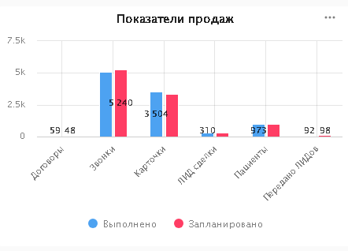

Дашборд по работе медицинского центра на Yandex Datalens (тестовое задание) 
==========================================================  

[Ссылка на дашборд](https://datalens.yandex.ru/tk4v5yp7ex6wi-svodnyy-dashbord)  

  

Данный дашборд был построен на основе [таблицы](https://github.com/peargrape/medical_center_dashboard/blob/main/src/task_for_analyst.xlsx) в соответствии с [техзаданием](https://github.com/peargrape/medical_center_dashboard/blob/main/src/task_description.jpg): 

  

Для выполнения задания требовалось выполнить следующие действия:  

1. Трансформировать таблицу в удобный для работы формат;  

2. Выбрать ключевые показатели, необходимые для отображения;  

3. Построить графики;  

4. Объединить графики в дашборде и настроить селекторы;  

5. Проанализировать данные, выведенные на дашборде.

Для начала следует сказать пару слов о Yandex Datalens. Это бесплатный и довольно неплохой инструмент для визуализации данных. Он уступает Power BI по возможностям, но при этом, будучи  бесплатным, позволяет решать бОльшую часть вопросов, связанных с визуализацией.  

В интернете имеется немало материалов о том, как построить свой первый дашбор, мне попался [вот этот](https://vc.ru/u/178354-petr-zagrebelnyy/720264-sozdaem-krutoy-finansovyy-otchet-na-osnove-vypiski-iz-tinkof-za-pol-chasa), его и рекомендую (подробная инструкция от и до вместо тысячи слов и долгих часов видео).
Также не могу не посоветовать [статью о функциях](https://cloud.yandex.ru/docs/datalens/function-ref/all) из справочника Yandex Cloud, материал изложен понятно и с примерами. Из неожиданного - наввание функции необходимо прописывать в специальном поле, а формула пишется сразу, без знака "равно".  

## 1. Трансформация таблиц  

Поскольку исходные таблицы представлены в не подходящем для работы с Datalens формате,  

  

  

  

их пришлось трансформировать и сохранить в .csv ([смотреть в папке](csv)).  

Наиболее ценная информация находится в таблице [`св_табл.csv`](csv/св_табл.csv):  

**Столбец**|**Описание**|**Тип**
-----|-----|-----
Позиция|Название статьи доходов или расходов|string
юл_фл|Статус клиента - юридическое или физическое лицо. Непустое значение только в случае, если значение столбца "операция" равно "доход"|timestamp|yes
тип|Категория расходов, в которую входят одно или несколько значений первого столбца, непустое значение только в случае, если значение столбца "операция" равно "расход"|string
операция|`доход` или `расход`|string
объект|Объект, который требует расходов и/или приносит прибыль|string
кол-во|Количество оказанных услуг, непустое значение только в случае, сли значение столбца "операция" равно "доход"|integer
сумма|Итоговая сумма дохода или расхода по данной позиции|Fractional number  
   

  

Сама долгая и важная работа сделана, ура!  

Переходим к следующей части.

## 2. Выбор ключевых метрик для отображения

Здесь всё довольно стандартно: в первую очередь, нам важно понять, приносит ли наш бизнес прибыль в принципе, затем проверить доходы и расходы по различным объектам. Также мы выясним, какой тип клиентов - физические или юридические лица - нам приносят больше прибыли, выясним среднюю цену услуги в зависимости от позиции продаж, а также проверим выполнение плана.

> В описании к тестовому заданию сказано следующее: "Dashboard должен выводить данные в разрезе когорт". **Это требование вызывает вопросы**, т.к., согласно [определению](https://roistat.com/rublog/kogorta/), "*Когорта — это часть аудитории, которая выполнила определённое действие в заданный период времени*". **В нашем же случае как таковых нет ни периода времени, ни аудитории**.  

## 3. Построение графиков  

Ниже приведены снимки и краткие описания основных графиков:  

- **Доход** - отражает доходы, расходы и прибыль организации в целом.

  

- **Доходы и расходы объектов**  

- **Выполнение плана по отделам**  

  

- **Показатели продаж** отражают выполнение планов различных этапов продаж  

- **Доходы от юрлиц и физлиц**  

  

- **Средняя цена услуг** - график с логарифмической шкалой Y, т.к. у нас имеется "выброс" по здравпункту.

  

## 4. Построение дашборда, настройка селекторов  

Графики построены, осталось соединить ихв одном дашборде и вставить селекторы.

Дашборд доступен по [ссылке](https://datalens.yandex.ru/tk4v5yp7ex6wi-svodnyy-dashbord).  

## 5. Анализ выведенных на дашборд данных  

Чем лучше составлен дашборд, тем точнее он отражает реальность, скрытую от нас цифрами.  

Вот какие выводы мы можем сделать:  

- Наша организация приносит прибыль, она составляет 1,2 миллиона, или около 10 процентов. Скорее всего, это ннеплохой показатель для столь  сложного бизнеса.  

- Юрлица приносят в 4 раза больше дохода, чем физлица.

- МЦ1 приносит почти в 2 раза больше прибыли, чем МЦ2, хотя расходует немного меньше.  

- Все отделы кроме СПЗ выполняют план, однако в СПЗ он более чем в 2 раза выше, чем в остальных.  

- У здравпункта очень высокая средняя цена услуги и самая высокая относительная прибыль. Стоит обратить внимание на то, что там происходит, возможно, перенять опыт.

- Самые высокие расходы ожидаемо связаны с оплатой труда.

- Ни один из показателей по сотрудникам не выполнен. Возможно, поставлены слишком сложные задачи; так или иначе, эта метрика была вынесена в отдельную таблицу, следовательно, она является важной. С этим надо что-то делать.  

Итак, мы разобрались, как трансформировать исходную таблицу для аналитической программы, построили графики с помощью Yandex Datalens, собрали дашборд по ключемым показателям и проанализировали ситуацию с нашим медицинским центром.

**Спасибо за внимание!**  

С уважением. Михаил Караваев  

Своими пожеланиями, замечаниями и предложениями вы можете поделиться со мной по эл. почте karavaevms(at)gmail(dot)com, Telegram @karavaevms, а также [LinkedIn](https://www.linkedin.com/in/mikhail-karavaev/)

